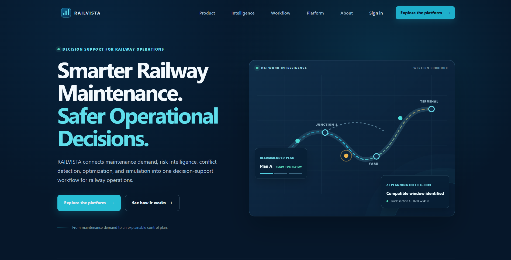

# RAILVISTA

RAILVISTA is an AI-powered railway maintenance block planning and decision-support system. It coordinates Engineering, S&T, and TRD maintenance demand, generates candidate plans with OR-Tools CP-SAT, evaluates risk, and presents results for human review.


## RAILVISTA Landing Page



## Project Overview

- `frontend/`: React 18, Vite, Tailwind CSS, React Router, Axios, and Recharts.
- `backend/`: Node.js, Express, Mongoose, MongoDB, JWT, Helmet, Morgan, and REST APIs.
- `ai-engine/`: FastAPI, Pandas, NumPy, SciPy, and OR-Tools CP-SAT.

Gemini-related code exists in `ai-engine/services/gemini_service.py`, but the current FastAPI app uses the deterministic explainability service and does not configure a Gemini SDK. Gemini is not required to start the current application.

Architecture: [docs/RAILVISTA_ARCHITECTURE.md](docs/RAILVISTA_ARCHITECTURE.md). Repository layout: [docs/RAILVISTA_PROJECT_STRUCTURE.md](docs/RAILVISTA_PROJECT_STRUCTURE.md).

## System Requirements

The repository does not pin Node.js, npm, or Git versions. The versions directly evidenced by the project are:

| Software | Version requirement |
|---|---|
| Node.js | Not pinned; Node.js 22 is used by the Dockerfiles. |
| npm | Not pinned; use the npm shipped with Node.js. |
| Python | Python 3.12 is used by the AI-engine Dockerfile and current environment. |
| MongoDB | MongoDB 8 is used by `docker/docker-compose.yml`; local version is not pinned by application code. |
| Git | Not pinned; required to clone the repository. |

An exact local version requirement cannot be stated for Node.js, npm, or Git without inventing a repository constraint.

## Required Software Installation

Install Node.js 22, Python 3.12, MongoDB, and Git using the official installer for your operating system. Alternatively, Docker Compose can provide MongoDB and all application services as described below.

The repository contains no operating-system-specific installation scripts for these tools.

## Environment Variables

### `frontend/.env`

There is no `frontend/.env.example`. The frontend reads only `VITE_API_BASE_URL` in `frontend/src/api/client.js`:

```dotenv
VITE_API_BASE_URL=http://localhost:4000/api
```

If omitted, the same URL is used as the frontend default. `VITE_AI_ENGINE_URL` is not read by the current frontend.

### `backend/.env`

Copy `backend/.env.example` to `backend/.env`:

```dotenv
NODE_ENV=development
PORT=4000
MONGODB_URI=mongodb://localhost:27017/railvista
JWT_ACCESS_SECRET=replace-with-a-long-random-secret
JWT_ACCESS_TTL=15m
AI_ENGINE_BASE_URL=http://localhost:8000
CORS_ORIGINS=http://localhost:5173
```

`JWT_ACCESS_SECRET` is required by `backend/src/config/env.js`. The other values have the defaults shown in that file. `MONGODB_URI` points to MongoDB, `PORT` controls Express, `JWT_ACCESS_TTL` controls token lifetime, `AI_ENGINE_BASE_URL` is the FastAPI URL, and `CORS_ORIGINS` is the allowed browser origin. `GEMINI_API_KEY` is not read by the current backend.

### `ai-engine/.env`

The exact existing template is:

```dotenv
APP_ENV=development
AI_ENGINE_PORT=8000
SCENARIO_COUNT_DEFAULT=1000
SOLVER_TIME_LIMIT_SECONDS=30
GEMINI_ENABLED=false
GEMINI_API_KEY=
GEMINI_MODEL=gemini-1.5-flash
```

The current FastAPI app does not load these variables. Its port is supplied by the Uvicorn command, and planning values are supplied in request bodies. Gemini variables are not active runtime configuration.

## Installing Dependencies

Frontend:

```powershell
Set-Location frontend
npm install
```

Backend:

```powershell
Set-Location backend
npm install
```

AI engine on Windows PowerShell:

```powershell
Set-Location ai-engine
python -m venv .venv
.venv\Scripts\Activate.ps1
pip install -r requirements.txt
```

AI engine on Linux/macOS:

```bash
cd ai-engine
python3 -m venv .venv
source .venv/bin/activate
pip install -r requirements.txt
```

The optional `ai-engine/requirements-dev.txt` includes the runtime requirements plus `pytest`.

## Running MongoDB

The application defaults to MongoDB port `27017` and database `railvista`.

Using the repository's Compose file:

```powershell
docker compose -f docker/docker-compose.yml up -d mongodb
```

This uses the `mongo:8` image and publishes `27017:27017`.

The repository has no Windows, Linux, or macOS MongoDB service-management command. Start MongoDB through the service manager or installation command supplied by your MongoDB installation. The repository also has no `mongosh` verification script. A successful seed operation is the repository-defined connection check.

## Running the AI Engine

After installing `ai-engine/requirements.txt`:

```powershell
python -m uvicorn app.main:app --app-dir ai-engine --reload --port 8000
```

The equivalent root script is:

```powershell
npm run dev:ai
```

URLs:

- Swagger UI: `http://localhost:8000/docs`
- Health: `http://localhost:8000/health`

## Running the Backend

Create `backend/.env`, start MongoDB and the AI engine, then run:

```powershell
Set-Location backend
npm install
npm run dev
```

The script runs `node --watch src/server.js`. The default port is `4000`. Expected output is:

```text
RAILVISTA backend listening on 4000
```

Health endpoint: `http://localhost:4000/api/health`.

## Running the Frontend

```powershell
Set-Location frontend
npm install
npm run dev
```

Vite serves the frontend at `http://localhost:5173` by default.

## Complete Startup Order

1. Start MongoDB on `27017`; the backend connects before listening.
2. Start the AI engine on `8000`; the backend forwards planning requests to it.
3. Start the backend on `4000`; it supplies authentication and REST APIs.
4. Start the frontend on `5173`; it consumes the backend API.

## Seeding Demo Data

### Synthetic railway dataset

The initial synthetic source is stored in `data/raw/`: `maintenance_jobs.csv`, `network.csv`, `stations.csv`, `trains.csv`, and `scenarios.csv`. The backend imports these once into MongoDB; runtime APIs and the AI engine use MongoDB records, never CSV files.

Run the import from the repository root:

```powershell
npm run seed --prefix backend
```

Set `DATA_DIR` in `backend/.env` only when the default `data/raw` location is moved. The importer validates CSV headers, skips existing natural keys, inserts only missing records, and records the last import in MongoDB.

With MongoDB running and backend dependencies installed:

```powershell
npm run seed --prefix backend
```

Expected output:

```text
RAILVISTA demo data seeded
```

The script creates the demo user `control@railvista.local` with password `password123` and three tasks for corridor `NDLS-KKDE`. It removes and recreates those demo records, so do not run it against production data. It does not seed block windows, planning runs, candidate plans, scenarios, notifications, or reports.

## Testing

Backend:

```powershell
npm test --prefix backend
```

This invokes Node's `node --test` runner. It currently discovers zero backend test files, so the command passes without executing test cases.

Frontend: no test script exists in `frontend/package.json`, so the repository defines no frontend test command.

Python:

```powershell
Set-Location ai-engine
python -m venv .venv
.venv\Scripts\Activate.ps1
pip install -r requirements-dev.txt
python -m pytest -q
```

The current AI-engine suite is `ai-engine/tests/test_core.py` and covers core GATI, priority, and risk calculations. No API test script or API test files are currently present.

## Build Commands

Frontend production build:

```powershell
npm run build --prefix frontend
```

This runs `vite build` and writes the production bundle to `frontend/dist/`.

Backend: no build script exists. The executable production command is:

```powershell
npm start --prefix backend
```

AI engine: no build script exists. Run it without reload using:

```powershell
python -m uvicorn app.main:app --app-dir ai-engine --port 8000
```

## Docker Compose

From the repository root:

```powershell
docker compose -f docker/docker-compose.yml up --build
```

Published ports are MongoDB `27017`, AI engine `8000`, backend `4000`, and frontend `80`. Compose supplies the internal hostnames `mongodb` and `ai-engine` to the backend.

## Common Problems

- **MongoDB connection failure:** verify MongoDB is listening on `27017` and `MONGODB_URI` matches it. The backend will not listen until its connection attempt succeeds.
- **JWT errors:** set a non-empty `JWT_ACCESS_SECRET` in `backend/.env` and restart the backend. Tokens from a previous secret become invalid.
- **Gemini API errors:** Gemini is not configured or instantiated by the current FastAPI app; no active Gemini verification is possible.
- **Python virtual environment problems:** activate `.venv\Scripts\Activate.ps1` on Windows or `source .venv/bin/activate` on Linux/macOS. PowerShell policy may require invoking `.venv\Scripts\python.exe` directly.
- **OR-Tools installation issues:** use Python 3.12 and install `ai-engine/requirements.txt` in the active interpreter. The optimizer imports `ortools.sat.python.cp_model`.
- **Port conflicts:** current ports are `27017`, `8000`, `4000`, and `5173`. Update the supported backend/Vite settings and matching URLs consistently if changing them.
- **CORS issues:** set `CORS_ORIGINS` to the exact frontend origin, normally `http://localhost:5173`, then restart the backend.
- **Node version mismatch:** Node.js is not pinned; Node.js 22 is the version evidenced by the Dockerfiles.

## Final Verification

## SIH planning implementation

The synthetic demo flow is: `TMS/SMMS/TDMS → MaintenanceTask → RiskClock/Priority → COA + timetable + goods forecast + network + assets + resources → block bundler → CP-SAT → simulation/risk/GATI → approval → weekly/monthly → publish`.

`data/raw/coa_availability.csv`, `goods_forecast.csv`, `asset_master.csv`, and `department_resources.csv` are deterministic synthetic Control Office and asset inputs. The seed validates their section references and performs natural-key upserts. TMS, SMMS and TDMS are source adapters for Engineering, S&T and TRD respectively; no live Indian Railways integration is claimed.

RiskClock is deterministic and persisted with factor evidence: `season × (severity×5 + overdue(capped)×4 + criticality×4.5 + weather×3.5 + asset importance×2.5 + section importance×2.5 + urgency×3 + availability impact×2)`, capped at 100. CP-SAT consumes this priority, only uses non-BLOCKED persisted COA windows, protects trains with a safety margin, enforces crew capacity, rewards bundle time saved, and penalizes forecast freight demand. GATI is `0.6 × mean delay + 0.4 × CVaR10 delay` (lower is better). Gemini remains explanation-only.

See [SIH requirements traceability](docs/SIH_REQUIREMENTS_TRACEABILITY.md) for implementation locations, APIs, tests, and honest limitations.

1. Run the seed command successfully to verify backend-to-MongoDB connectivity.
2. Open `http://localhost:4000/api/health` and expect status `ok`.
3. Open `http://localhost:8000/health` and expect the AI-engine service name and status `ok`.
4. Open `http://localhost:5173` and confirm the login page loads.
5. Sign in with `control@railvista.local` and `password123` after seeding.
6. Use FastAPI Swagger at `http://localhost:8000/docs` to call `POST /v1/plans/generate` with valid task and window data; this verifies OR-Tools.
7. Call `POST /v1/risk/analyze` with an outcome list to verify risk metrics and GATI calculation. The current backend does not expose a separate scenario endpoint.
8. Gemini cannot be verified as active because the current app does not load its environment variables or configure a Gemini SDK client.

## Missing Implementation Confirmed During Inspection

The current repository does not define exact Node.js, npm, or Git version pins; a frontend `.env.example`; AI-engine environment loading; active Gemini SDK integration; backend or AI build scripts; frontend, backend, or API test suites; a MongoDB verification script; or seeded planning/simulation/report fixtures. These must be added before claiming those capabilities as fully production-ready.
