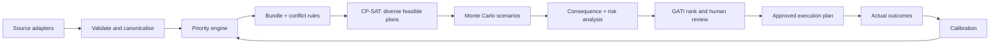
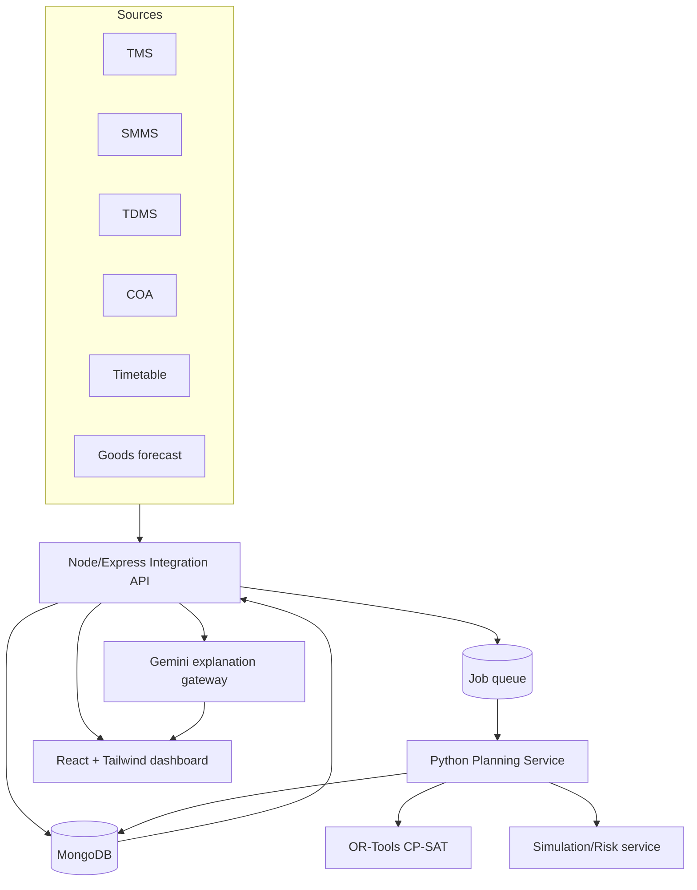
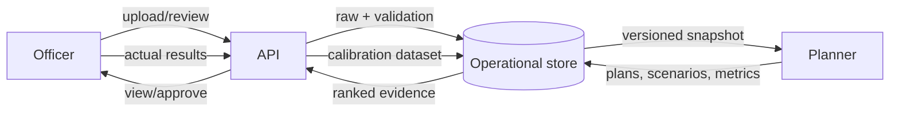
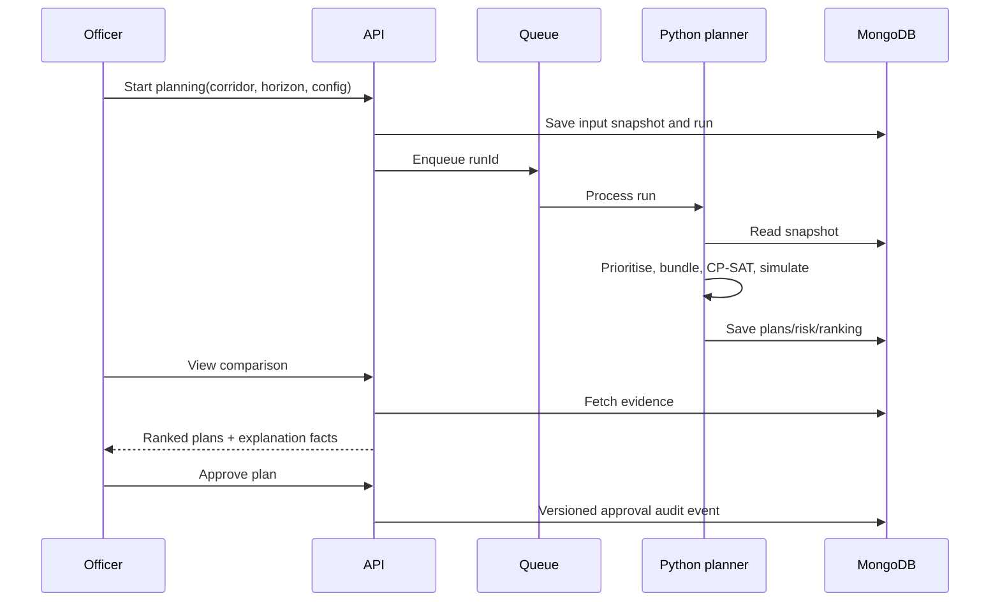
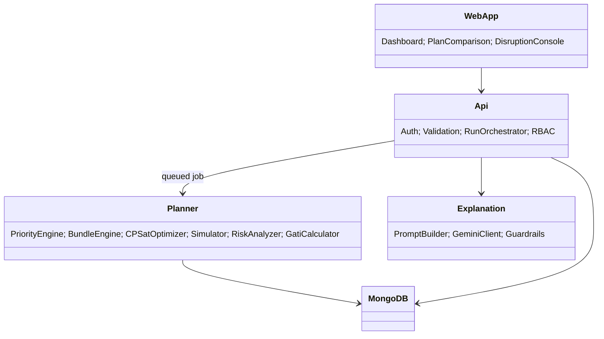
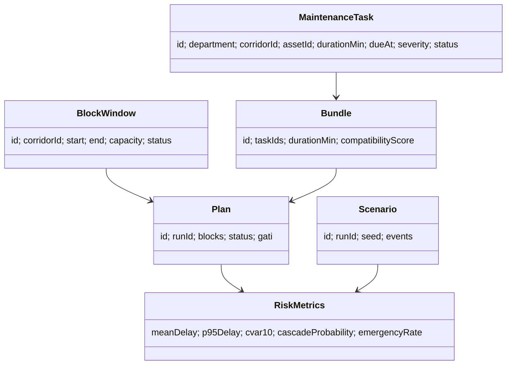
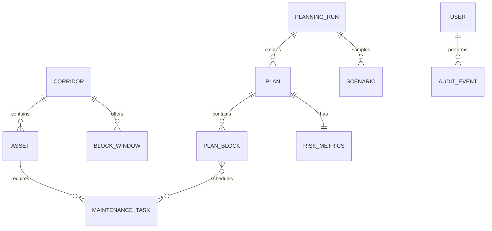
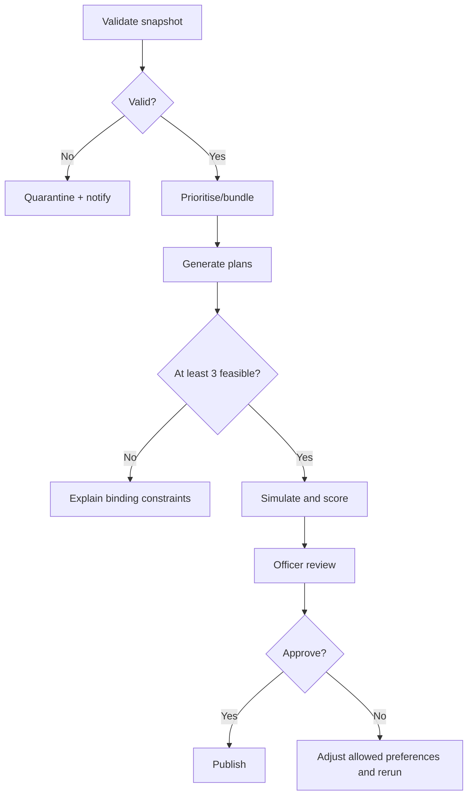
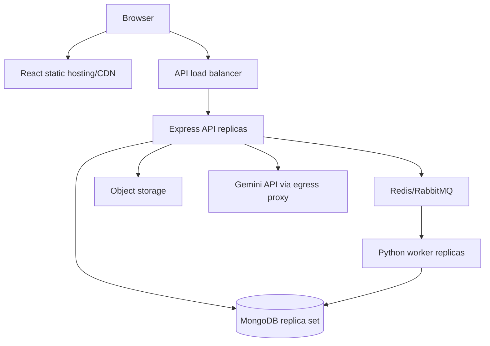

# RAILVISTA — Solution Architecture and Engineering Blueprint

**Version:** 1.0 | **Audience:** Indian Railways operational stakeholders, SIH jury, delivery team

## 1. Executive summary

RAILVISTA is an AI-powered decision-support system for jointly planning Engineering, Signal & Telecommunication (S&T), and Traction Distribution (TRD) maintenance blocks. It ingests departmental maintenance demand (TMS, SMMS, TDMS), Corridor Availability (COA), timetable and goods-traffic forecasts; bundles compatible work; generates several feasible CP-SAT plans; stress-tests each plan under uncertainty; and recommends the plan with the lowest **GATI** (Guaranteed Availability Through Intelligence) risk score.

The business outcome is fewer separately requested blocks, higher work completed per block, less avoidable possession time, and an auditable explanation for control officers. RAILVISTA recommends; the authorised railway officer approves and executes.

## 2. Vision

Move from independent, calendar-driven block requests to corridor-aware, cross-department, risk-aware planning. A good plan is not merely feasible in a nominal timetable: it remains safe and operationally acceptable across likely rain, overruns, traffic variation, failures and occupancy disruptions.

## 3. Problem statement

TMS, SMMS and TDMS hold related maintenance needs but do not produce a common possession plan. BDMS requests arrive independently and COA availability is considered late. This creates duplicate blocks, idle capacity inside possessions, manual conflict resolution, passenger/goods impact and weak traceability.

## 4. Existing system

| Area | Current state | Consequence |
|---|---|---|
| Demand | Departmental silos | Compatible work is missed |
| Planning | Manual/first-come request handling | Local optimum, planner dependence |
| Availability | COA checked after requests | Rework and rejected blocks |
| Disruption | Spreadsheet/phone coordination | Slow recovery |
| Learning | Predicted and actual impact not joined | No calibrated risk model |

## 5. Proposed system

An integration layer normalises source records into a canonical rail-corridor model. A priority engine ranks tasks, a bundler proposes safe co-work groups, and a deterministic rules engine rejects unsafe/resource-conflicting candidates. OR-Tools CP-SAT produces a diverse plan set. Monte Carlo and a consequence model measure robustness, after which GATI selects the recommended plan. Gemini receives only completed plan/risk facts to explain—not to schedule.

## 6. Innovation: decision support, not a scheduler

A scheduler optimises one assumed future. RAILVISTA returns Pareto-diverse feasible plans, evaluates each across simulated futures, exposes tail risk, preserves human authority, repairs only affected remaining work, and calibrates from execution outcomes. The innovation is the coupling of cross-department bundling, stochastic robustness and explainable operational trade-offs.

## 7. Functional requirements

1. Import/API-adapt TMS, SMMS, TDMS, COA, timetable and goods forecasts.
2. Validate, map and version source data; quarantine invalid records.
3. Calculate task priority and explain its factors.
4. Identify safe bundle candidates across departments.
5. Detect safety, resource, track and temporal conflicts.
6. Generate at least three materially distinct feasible plans with CP-SAT.
7. Simulate configurable (default 1,000) scenarios per plan.
8. Calculate consequences, risk metrics and GATI; rank plans.
9. Support review, approval, publication, execution updates and audit trail.
10. Repair only unexecuted work after a disruption, respecting fixed completed/in-progress blocks.
11. Compare predicted/actual results and calibrate distributions.
12. Provide role-based dashboards, exports and Gemini explanations.

## 8. Non-functional requirements

Safety constraints are hard constraints; no optimisation may relax them. A planning run must be reproducible from data snapshot, seed, model version and configuration. Target: p95 dashboard API under 2 s, normal corridor planning under 5 min and 3,000 plan-scenarios/min per worker (baseline to be load-tested). Availability target 99.5% for planning services, RPO 15 min, RTO 4 h. All times use IST plus UTC storage; every decision is auditable. The system horizontally scales simulation workers and never exposes operational data to an external LLM without policy approval.

## 9. User stories

| Role | Need | Acceptance criterion |
|---|---|---|
| Control Officer | Compare feasible plans | sees GATI, P95, conflicts and rationale |
| Engineering Officer | Include overdue work | task priority and feasibility are visible |
| S&T Officer | Bundle compatible work | compatibility/safety reason is recorded |
| TRD Officer | Protect isolations/resources | hard constraints prevent unsafe overlap |
| Admin | Govern data/access | sources, roles and audit events are managed |
| Planner | Repair after a failure | completed work stays fixed; only remainder changes |

## 10. Complete workflow



## 11. High-level architecture



Node owns identity, CRUD, validation orchestration and external API contracts. Python owns numerical optimisation/simulation; this avoids placing OR-Tools computation in an event-loop process. MongoDB stores operational documents and run snapshots; an object store holds import files/reports.

## 12. Low-level architecture

The Express API writes an immutable `planningRuns` input snapshot and queues work by `runId`. Python loads that exact snapshot, validates it again, generates plans, persists plan versions and metrics, then emits progress events. Web clients poll or receive Server-Sent Events. The explanation gateway builds a structured, redacted prompt from persisted metrics; it cannot call the optimiser or alter a plan.

## 13. Data-flow diagram



## 14. Planning sequence



## 15. Component diagram



## 16. Domain class diagram



## 17. ER diagram



## 18. Activity diagram



## 19. Deployment diagram



## 20. System architecture decisions

CP-SAT is selected over greedy heuristics because it enforces simultaneous hard safety/resource/time constraints and can prove optimality or bounded feasibility. It is selected over an LLM because LLM output is probabilistic, cannot certify constraints, and is unsuitable for safety-critical combinatorial decisions. Monte Carlo is layered after optimisation instead of embedded in each CP-SAT search: this keeps solve time tractable and measures resilience independently. MongoDB fits heterogeneous imported records and evolving scenario payloads; snapshot schemas and indexes retain governance.

## 21. Module breakdown

| Module | Responsibility | Boundary |
|---|---|---|
| Connectors | Map source systems to canonical records | no planning decisions |
| Data quality | schema, referential, temporal validation | rejects/quarantines bad inputs |
| Priority | deterministic weighted ranking | configuration version required |
| Bundling | safe co-location candidate generation | never overrides safety rules |
| Conflict | hard-rule validation | shared by optimiser and UI |
| Optimiser | diverse CP-SAT plan generation | no LLM calls |
| Simulator | sampled disruption consequences | seeded/reproducible |
| Risk/GATI | aggregate metrics and rank | immutable result version |
| Repair | reoptimise only remaining movable work | preserves execution locks |
| Explanation | Gemini narrative/report/Q&A | read-only evidence inputs |
| Feedback | calibration and model monitoring | human-approved parameter release |

## 22. Repository/folder structure

```text
railvista/
  frontend/src/{features,components,api,stores,charts}
  backend/src/{config,models,controllers,services,routes,middleware,jobs}
  ai_engine/{api,domain,services,tests}
  ai_engine/services/{optimizer,priority_engine,bundle_engine,scenario_simulator,risk_analysis,gati,repair,gemini_service}.py
  shared/{openapi,json-schemas}
  infra/{docker,k8s,terraform,monitoring}
  docs/
```

## 23. Database design

Collections: `users`, `roles`, `corridors`, `assets`, `maintenanceTasks`, `blockWindows`, `timetables`, `goodsForecasts`, `planningRuns`, `plans`, `scenarios`, `riskMetrics`, `disruptions`, `executionEvents`, `calibrationVersions`, `auditEvents`, `imports`.

Relationships use immutable IDs: task→asset/corridor; plan→run; plan blocks→task IDs/window IDs; risk metrics→plan/version. Embed small plan-block arrays in a plan; reference high-volume scenario outcomes by plan/run. Index `maintenanceTasks(corridorId,status,dueAt)`, `blockWindows(corridorId,start,end)`, `plans(runId,gati)`, `riskMetrics(planId)`, `auditEvents(entityType,entityId,occurredAt)`, and TTL expiry for raw temporary import staging only. Never TTL approved plans/audits.

## 24. Data dictionary

| Field | Type | Meaning / validation |
|---|---|---|
| taskId | UUID/string | immutable source-mapped identifier |
| department | enum | ENGINEERING, SNT, TRD |
| corridorId | ID | valid active corridor |
| durationMin | integer | positive planned work duration |
| severity | 1–5 | governed defect classification |
| priorityScore | 0–100 | versioned calculated result |
| windowStart/end | UTC datetime | end must exceed start |
| resources | array | staff/plant/isolation identifiers |
| meanDelayMin | number | expected simulated total delay |
| cvar10DelayMin | number | mean of worst 10% outcomes |
| gati | number | `0.6*meanDelayMin + 0.4*cvar10DelayMin` |

## 25. API design

All endpoints require JWT except health. Return `{data, meta:{requestId}}`; errors use RFC 7807-shaped `{type,title,status,detail,errors}`.

| Method/path | Purpose | Request / response summary |
|---|---|---|
| POST `/auth/login` | issue tokens | credentials → access/refresh token |
| POST `/imports` | create source import | source, file reference → importId/status |
| GET `/tasks` | filter canonical demand | query corridor/status → paged tasks |
| POST `/planning-runs` | start run | corridorId, horizon, configVersion → runId/QUEUED |
| GET `/planning-runs/:id` | progress/snapshot metadata | → status, stages, versions |
| GET `/planning-runs/:id/plans` | compare plans | → plans with metrics/rank |
| GET `/plans/:id` | plan detail | → blocks, tasks, constraints, risk |
| POST `/plans/:id/approve` | authorised approval | comment/version → approval event |
| POST `/disruptions` | record incident | type, affected window, observedAt → disruptionId |
| POST `/plans/:id/repair` | repair remainder | disruptionId → new runId |
| POST `/explanations` | grounded explanation | planIds, question → cited narrative |
| POST `/execution-events` | actual block outcome | planBlockId, actuals → accepted event |
| GET `/reports/:runId` | download generated report | → signed document reference |

Example start request: `{"corridorId":"NDLS-KKDE","horizon":{"from":"2026-10-01","to":"2026-10-07"},"scenarioCount":1000,"configVersion":"v1"}`. Response: `{"data":{"id":"run_123","status":"QUEUED"}}`.

## 26. Python module design

`optimizer.py` builds CP-SAT models and returns plan candidates; `priority_engine.py` computes governed scores; `bundle_engine.py` proposes compatible groups; `conflict_detector.py` validates hard rules; `scenario_simulator.py` generates seeded event vectors and outcomes; `risk_analysis.py` calculates statistics; `gati.py` applies the published formula; `repair.py` locks executed/in-progress work and solves the remainder; `gemini_service.py` formats evidence-only prompts through a provider interface; `schemas.py` holds Pydantic contracts; `repository.py` abstracts persistence. Each has unit tests and pure domain functions where possible.

## 27. OR-Tools CP-SAT design

For task/bundle `i` and feasible window `w`, binary `x[i,w]=1` means scheduled. `s[i]` is start time and optional interval `I[i]` has duration `d[i]`.

Hard constraints: assignment `Σw x[i,w] ≤ 1` (or `=1` for mandatory task); interval contained in selected COA window; `NoOverlap` per track/resource/isolation; precedences; minimum setup/headway; department competence; prohibited weather/asset combinations; fixed execution locks. Bundles are selected atomically only if all required safety preconditions hold.

Primary objective minimises a weighted deterministic proxy: `α unscheduledCritical + β overdue + γ possessionMinutes + δ timetableImpact - ε bundledWorkValue`. Lexicographic priorities or sufficiently separated weights ensure safety/mandatory work precedes utilisation. Plan diversity uses solution exclusion/cuts: require each next plan to differ in at least `k` key assignments, then vary approved secondary weights.

```text
validate(snapshot); candidates = make_safe_bundles(tasks)
for diversity_profile in profiles:
  model = CP-SAT(); add_variables_and_hard_constraints(model)
  add_objective(model, diversity_profile); add_difference_cuts(previous)
  solve within time limit; validate independent rules; persist feasible plan
return non-dominated distinct plans
```

CP-SAT is NP-hard in the general job-shop/set-packing form; worst-case complexity is exponential. Control it through corridor/horizon decomposition, candidate-window pruning, bundle caps, time limits, warm starts and parallel independent plan generation. It guarantees constraint consistency for returned solutions, but quality depends on data and solve budget.

## 28. Monte Carlo design

For each plan, draw 1,000 seeded scenario vectors. Use empirical distributions where historical data is sufficient; otherwise governed triangular distributions reviewed by domain experts. Examples: rain occurrence Bernoulli conditioned on season/location; overrun lognormal or empirical positive residual; goods delay empirical/triangular; passenger increase Poisson/negative-binomial; incident types categorical with mutually exclusive/conditional rules. Correlations (e.g., heavy rain and overrun) are sampled through a shared weather state, not independent draws.

```text
for plan in plans:
  for seed in seeded_range(N):
    events = scenario_generator(seed, context, calibration_version)
    outcome = consequence_simulator(plan, events, timetable, forecast)
    store(plan, seed, events, outcome)
  metrics = risk_analysis(outcomes)
  gati = 0.6*metrics.mean_delay + 0.4*metrics.cvar10_delay
```

Monte Carlo cost is `O(P × N × C)`, where `P` plans, `N` scenarios and `C` consequence-model cost. Scenarios parallelise by plan/seed. Benefits: measures uncertainty and tail impact. Limits: it estimates rather than proves risk; poor distributions produce misleading confidence, so report seed, confidence intervals and calibration version.

## 29. Risk analysis

Given total-delay outcomes `D1…Dn`: `Mean = (ΣD)/n`; `P95` is the empirical 95th percentile; `CVaR10 = mean(Di | Di >= VaR90)`—the mean delay in the worst 10% of outcomes. `CascadeProbability = count(cascadeCount>0)/n`; `EmergencyRate = Σ emergencyCount/n`. Also display maximum delay, cancellations and scenario confidence intervals. Mean informs typical impact; P95/CVaR protect against bad-but-plausible operating days.

## 30. GATI

`GATI = 0.6 × MeanDelay + 0.4 × CVaR10Delay` (minutes; lower is better). The 60/40 weighting values ordinary service impact while materially penalising severe tail events. Business meaning: expected delay with a resilience penalty. Engineering meaning: a scalar rank for comparable plan alternatives, never a substitute for hard safety constraints. Before deployment, weights must be signed off by railway governance; publish sensitivity analysis because weighting is a policy choice.

## 31. Gemini integration

Gemini sits after persisted optimisation/risk results. Inputs are structured plan facts, metric deltas, scenario summaries, approved policy text and user question; PII/operational-sensitive fields are redacted/minimised. Outputs are a concise explanation, comparison table, report draft, what-if narrative or Q&A response with source IDs. Prompt rule: “Do not recommend an infeasible action; do not create schedule values; state uncertainty; cite supplied evidence only.” Responses show an AI-generated label and retain prompt/model/version/audit metadata. A deterministic template is the fallback. Gemini has no write access to plans, no optimisation tool and no authority to approve.

## 32. Dashboard design

Pages: **Command overview** (active corridor, recommended plan, alert cards); **Demand & data quality** (department backlog, invalid records); **Plan comparison** (GATI bars, mean/P95/CVaR scatter, utilisation, task coverage); **Plan detail** (Gantt/timeline, resource lane, conflict badges); **Scenario explorer** (histogram, tail scenarios, cascades); **Disruption repair** (frozen vs movable blocks, before/after); **Execution & feedback** (predicted vs actual); **Admin** (roles, sources, configurations, audit). Use accessible colours plus labels—red/amber/green must not be the sole signal.

## 33. User roles

Control Officer approves/publishes and views all corridors. Engineering/S&T/TRD Officers manage their demand, attest task data, review bundles and view authorised corridor plans. Admin manages users, connectors, model configurations and retention. Separation of duties prevents an administrator from silently approving an operational plan; approval requires named delegated authority.

## 34. Security

Use OIDC/password policy with short-lived JWT access tokens, rotating refresh tokens, bcrypt/Argon2 hashed passwords, HTTPS/TLS, and RBAC enforced server-side on every endpoint. Validate JSON schema, scan files, rate-limit auth, protect secrets in a vault, encrypt storage/backups, log immutable audits, segregate environments, and conduct dependency/SAST/DAST checks. Apply least-privilege service accounts and egress allowlisting for Gemini. Never put tokens, raw credentials or sensitive timetable exports in browser logs.

## 35. Scalability

Stateless API replicas scale behind a load balancer; queue-based workers scale independently from web demand. Partition planning jobs by corridor/horizon and avoid cross-corridor decomposition where interlocking constraints demand a unified solve. Use Mongo indexes, paginated APIs, preaggregated dashboard metrics, object storage for large artifacts and worker concurrency limits to protect the database. Long simulations are asynchronous jobs, never HTTP requests.

## 36. Performance engineering

Cache immutable configuration/reference data, batch persistence, index run/plan lookup paths, prune infeasible task-window pairs before CP-SAT, cap candidate bundles, and parallelise simulation seeds. Track solver wall time, optimality gap/status, queue latency, scenario throughput and DB query p95. Do not cache approval/execution state without explicit invalidation/version keys.

## 37. Testing strategy

Unit-test score formulas, conflict rules, distributions, CVaR boundaries and role checks. Integration-test adapter→snapshot→worker→API contracts against ephemeral Mongo/queue. Property-test that no generated plan violates independent safety validation. Use historical replay/backtesting for consequence calibration. Run load tests for concurrent dashboards/jobs, soak tests for queue leaks, chaos tests for worker/API loss and security tests for broken access control, injection and token replay. Acceptance tests must be signed off against realistic corridor cases with railway SMEs.

## 38. Deployment

Build signed frontend, Node and Python images; scan them; deploy dev→staging→production through CI/CD with database migrations and rollback plans. Kubernetes is appropriate at multi-corridor scale; Docker Compose is sufficient for SIH/demo. Use managed Mongo replica set, persistent queue, secret manager, monitored backups, configuration-as-code and production change approvals. Feature-flag Gemini and new calibrated distributions.

## 39. Logging and observability

Emit structured JSON with `requestId`, `runId`, `planId`, source/version, actor and correlation IDs; redact secrets/PII. Metrics: run success/failure, solver status/gap/time, queue depth, scenario throughput, API latency, data-quality rejects, approval and repair latency. Trace API→queue→worker. Alert on failed runs, repeated invalid imports, missing calibration, elevated error rate and abnormal plan-risk shifts. Keep an immutable approval/audit trail separate from diagnostic-log retention.

## 40. Error handling

Reject invalid inputs with field-level 400 errors; return 401/403 for identity/role failures; 409 for stale plan approval/version conflict; 422 for valid but operationally infeasible requests; 429 for rate limits; 503 for retryable dependencies. Jobs transition `QUEUED→RUNNING→COMPLETED|FAILED|CANCELLED`, persist a safe failure reason, retry transient failures with exponential backoff, and never auto-approve or silently substitute a plan after failure.

## 41. Future scope

Add live train-position feeds, digital-twin network propagation, crew/rolling-stock integration, weather provider integration, federated/de-identified learning across zones, multi-corridor optimisation, mobile field execution, and formal safety-case evidence. Each expansion requires governance, data-sharing and safety validation—not merely a model upgrade.

## 42. Advantages

Business: higher block utilisation and lower disruption cost. Technical: reproducible constraint-safe plans and separable compute scaling. AI: calibrated uncertainty rather than unsupported prediction. Railway: preserves possession, interlocking and isolation rules. User: clear alternatives and reasons. Scalability: connector/worker architecture supports staged rollout.

## 43. Limitations

Outputs are only as reliable as source quality, rule completeness and calibrated scenario distributions. CP-SAT may time out on oversized horizons; it returns best feasible results, not a guarantee of global optimum unless proven. Monte Carlo can miss rare events. Integration with live railway control systems must be read-only/approval-gated initially. RAILVISTA does not replace railway safety procedures or human control authority.

## 44. Twelve-week implementation roadmap

| Weeks | Deliverable |
|---|---|
| 1–2 | canonical schema, roles, synthetic data, architecture baseline |
| 3–4 | imports, validation, task/COA/timetable UI |
| 5–6 | priority, bundling, conflicts, CP-SAT MVP |
| 7–8 | plan comparison, scenario/consequence/risk/GATI |
| 9 | approval, disruption repair, audit trail |
| 10 | Gemini grounded explanation and reports |
| 11 | feedback calibration, testing, performance hardening |
| 12 | deployment rehearsal, demo data and railway SME validation |

## 45. Team responsibilities

Principal Architect owns boundaries/safety governance; Railway Operations Expert owns rules and acceptance cases; OR Engineer owns CP-SAT model; AI Research Scientist owns scenarios/calibration; Data Engineer owns adapters/quality; Python Architect owns planning services; MERN Developer owns API/UI; DevOps owns CI/CD/observability; Product Manager owns outcomes/backlog; Documentation Specialist owns traceable architecture, API and demo material.

## 46. Git repository structure

Use the structure in section 22, with `README.md`, `CONTRIBUTING.md`, `SECURITY.md`, `.github/workflows`, `docs/adr`, `docs/runbooks`, `tests/fixtures` and `shared/openapi`. Commit synthetic fixtures only; production exports belong in protected storage.

## 47. Branching strategy

Use protected `main`, short-lived `feature/<ticket>-<name>` branches and urgent `hotfix/<ticket>`. Pull requests require tests, lint, security scan and code review; optimisation-rule changes additionally require OR and railway-domain review. Tag releases, version schemas/configurations, and use conventional commits for generated release notes.

## 48. Judge questions and strong answers

1. **What problem is solved?** Coordinated maintenance possessions across three silos.
2. **Why now?** Traffic pressure makes unused/duplicated blocks increasingly costly.
3. **Is it a scheduler?** No; it ranks resilient alternatives under uncertainty.
4. **Why CP-SAT?** It enforces discrete hard constraints reproducibly.
5. **Why not an LLM optimiser?** It cannot guarantee feasibility or audit a safety model.
6. **Why Gemini?** Grounded explanations, reports and Q&A after computation.
7. **What is GATI?** Mean delay plus a tail-risk penalty; lower is safer operationally.
8. **Why not average delay alone?** Averages hide severe disruption days.
9. **What is CVaR10?** Average delay in the worst 10% simulations.
10. **Why Monte Carlo?** It tests plans against variable operating conditions.
11. **How many scenarios?** Default 1,000; configurable after convergence testing.
12. **Are scenarios random?** Seeded and versioned, so results are reproducible.
13. **How is rain modelled?** Seasonal/location-conditioned historical or governed assumptions.
14. **How are correlations handled?** Shared states, such as weather, drive linked events.
15. **How do you prevent unsafe plans?** Safety/interlocking/isolation rules are hard constraints and independently revalidated.
16. **Who approves?** A named authorised Control Officer.
17. **Can the system execute blocks?** It recommends; execution remains under railway control.
18. **How are department tasks combined?** Through compatibility rules and resource/safety validation.
19. **What if no plan exists?** Return binding constraints and unmet demand, never fabricate one.
20. **How are multiple plans different?** Assignment-difference cuts and varied approved trade-off profiles.
21. **How is plan repair different?** It freezes completed/in-progress work and optimises only movable remainder.
22. **How do you avoid rescheduling chaos?** Minimal-change penalties are part of repair objective.
23. **What data is required?** Task demand, assets, windows, timetable, forecasts and operational rules.
24. **What if source data is missing?** Quarantine/flag it and use only governed fallback assumptions.
25. **How do you handle bad data?** Schema, referential and temporal validation with import lineage.
26. **How do you learn?** Compare predicted/actual outcomes and release reviewed calibration versions.
27. **Does learning change safety constraints?** No; safety rules require formal governance.
28. **How is explainability trustworthy?** Gemini sees structured results and source IDs, not free-form planning access.
29. **How is hallucination controlled?** Evidence-only prompts, redaction, templates and audit logging.
30. **Why MongoDB?** Evolving imported documents/scenarios with indexed operational queries.
31. **Why Python plus Node?** Python suits OR/numerics; Node provides robust web/API integration.
32. **How does it scale?** Stateless APIs and independently scalable queued workers.
33. **What is the runtime risk?** NP-hard solves; mitigate by decomposition, pruning and time limits.
34. **Can it prove optimality?** CP-SAT reports status/gap; feasibility is still valuable under limits.
35. **What is the primary metric?** GATI for rank, with P95/CVaR and safety constraints visible.
36. **Can GATI be gamed?** Publish formula/config, preserve raw metrics and use governance.
37. **Why 60/40?** It is an explicit starting policy weighting typical and tail impact; validate with operators.
38. **How is privacy protected?** RBAC, encryption, minimised LLM payload and auditability.
39. **How is access controlled?** JWT plus server-side RBAC and separation of duties.
40. **What happens if Gemini fails?** Deterministic metrics/templates remain available; planning continues.
41. **What happens if optimiser fails?** Run is failed transparently; no automatic approval/substitution.
42. **How are delays calculated?** The consequence simulator propagates occupancy and timetable impact per scenario.
43. **Can it use real-time data?** Future integration; initial deployment is approval-gated planning support.
44. **What is the MVP?** One corridor, synthetic/adapted inputs, 3 plans, 1,000 scenarios, approval UI.
45. **How do you validate benefit?** Historical replay and pilot KPIs: bundled tasks, block minutes, delay risk.
46. **What makes it railway-specific?** Possession windows, track occupancy, isolations, headways and departments.
47. **How is audit ensured?** Snapshot, seed, solver/model/config versions and named approvals are stored.
48. **What are key limitations?** Data quality, model calibration and compute-bound large horizons.
49. **Can it cover other zones?** Yes through connector/configuration rollout after local rule validation.
50. **What is the human benefit?** Faster, evidence-backed choices without removing accountability.

## 49. Five-minute presentation strategy

0:00–0:40 show silo problem and cost. 0:40–1:20 show one corridor’s integrated demand/COA. 1:20–2:10 show bundling and constraint-safe plan generation. 2:10–3:05 compare three plans with simulation distribution and GATI. 3:05–3:45 show grounded “why this plan” explanation. 3:45–4:30 inject rain/overrun and demonstrate minimal repair. 4:30–5:00 close with human approval, measurable pilot KPIs and rollout path. Lead with a concrete before/after possession story, not technology names.

## 50. Demo flow

1. Sign in as Control Officer and choose a seeded demo corridor. 2. Show imported Engineering/S&T/TRD demand, COA windows and data-quality status. 3. Select two compatible tasks and display bundle rationale. 4. Start a planning run; show stage progress. 5. Open Plan A/B/C comparison: schedule, coverage, utilisation, mean/P95/CVaR/GATI. 6. Select lowest-GATI plan and request “why”; show evidence-grounded trade-offs. 7. Approve with comment; audit event appears. 8. Inject heavy rain plus an overrun. 9. Run repair and show fixed completed work versus minimal changes. 10. Record actual result and show feedback calibration queue. Pre-seed all data/results and retain a fallback video/export for network failures.

## 51. Why OR-Tools instead of LLMs

Scheduling is a constrained combinatorial optimisation problem: decisions must satisfy track, time, possession, isolation, resource and precedence constraints at once. CP-SAT represents those constraints formally, returns a valid assignment or clear infeasibility/status, and is reproducible. LLMs predict text, may be inconsistent across identical prompts and cannot provide a safety feasibility guarantee. Therefore CP-SAT makes decisions; LLMs communicate them.

## 52. Why Gemini is used after optimisation

After optimisation, the system has authoritative facts: selected assignments, trade-offs, conflict checks and risk measures. Gemini converts this evidence into officer-friendly explanations, comparisons and reports, while guardrails prevent it from inventing changes. This preserves both deterministic planning integrity and natural-language usability.

## 53. Why Monte Carlo strengthens the system

Nominal feasibility says a plan can work in one assumed world. Sampling weather, overruns, demand and incident conditions estimates its sensitivity across many plausible worlds. This exposes cascade and tail effects before approval, creates a fair comparison among feasible plans and supports calibration from actual operations.

## 54. Why GATI is better than average delay

Two plans can have the same average delay while one occasionally causes extreme disruption. GATI combines mean impact with the mean of the worst 10% outcomes, making hidden fragility visible. It is still paired with P95, emergency/cascade metrics and non-negotiable safety rules, not used alone.

## 55. Difference from a traditional scheduler

Traditional scheduling commonly selects one efficient nominal timetable. RAILVISTA integrates departmental work, creates safe bundles, produces alternatives, simulates uncertainty, ranks tail-risk robustness with GATI, explains evidence in natural language, repairs only the remaining plan and learns from predicted-versus-actual outcomes. It is a governed, human-in-the-loop operational decision platform.

